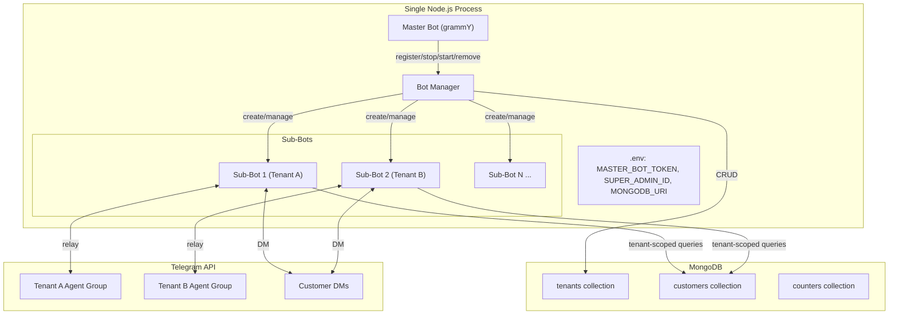
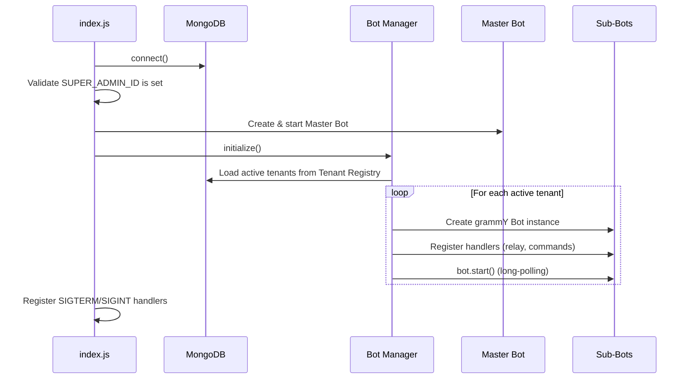

# Design Document: Multi-Tenant Bot System

## Overview

This design transforms the existing single-tenant Paydora support bot into a multi-tenant system running within a single Node.js process. The architecture introduces three new components:

1. A **Master Bot** — a dedicated grammY instance that only the Super Admin interacts with, handling tenant registration and lifecycle commands.
2. A **Bot Manager** — an in-process singleton that creates, starts, stops, and tracks Sub-Bot grammY instances.
3. A **Tenant Registry** — a MongoDB collection storing tenant configurations, enabling persistence across restarts.

Each registered tenant gets its own grammY Bot instance (Sub-Bot) that reuses the existing relay and PII logic, but scoped to the tenant's agent group and customer data via a `tenantId` field. All Sub-Bots share a single MongoDB connection and run long-polling concurrently in the same process.

### Key Design Decisions

- **Single process, multiple Bot instances**: grammY supports multiple `Bot` instances in one process, each calling `bot.start()` with independent long-polling loops. No child processes or workers needed.
- **Tenant scoping via `tenantId`**: Rather than separate collections per tenant, we add a `tenantId` field to the existing `Customer` model and use compound indexes. This keeps the schema simple and queries efficient.
- **Relay/PII as pure functions with injected context**: The existing `relay.js` and `pii.js` modules are refactored to accept `agentGroupId` and `tenantId` as parameters instead of reading from `process.env`. This makes them tenant-agnostic without duplicating code.
- **Master Bot is separate from Sub-Bots**: The Master Bot has its own token (`MASTER_BOT_TOKEN`) and only processes admin commands. It never handles customer messages.

## Architecture



### Startup Sequence



## Components and Interfaces

### 1. Master Bot (`src/master.js`)

Responsibilities:
- Authenticate commands against `SUPER_ADMIN_ID`
- Handle `/register`, `/stop`, `/start`, `/remove`, `/list`, `/status` commands
- Delegate lifecycle operations to Bot Manager

```javascript
// Interface
function createMasterBot(token, superAdminId, botManager) → Bot
```

Commands:
| Command | Parameters | Action |
|---------|-----------|--------|
| `/register` | `<bot_token> <agent_group_id> <admin_user_id>` | Validate token, verify admin in group, store tenant, start Sub-Bot |
| `/stop` | `<tenant_id>` | Stop Sub-Bot, set status "inactive" |
| `/start` | `<tenant_id>` | Start Sub-Bot, set status "active" |
| `/remove` | `<tenant_id>` | Stop Sub-Bot, set status "removed" |
| `/list` | — | List all tenants with statuses |
| `/status` | `<tenant_id>` | Show tenant details and Sub-Bot uptime |

All commands are guarded by a middleware that checks `ctx.from.id === superAdminId`. Non-matching senders are silently ignored.

### 2. Bot Manager (`src/bot-manager.js`)

Responsibilities:
- Maintain a `Map<tenantId, { bot, startedAt }>` of running Sub-Bot instances
- Create Sub-Bot instances with tenant-scoped handlers
- Handle start/stop/restart lifecycle
- Retry failed starts (up to 3 attempts, 5s delay)

```javascript
class BotManager {
  constructor() 
  async loadAndStartAll()           // Load active tenants, start each
  async startBot(tenant)            // Create, register handlers, start polling
  async stopBot(tenantId)           // Stop polling gracefully
  async restartBot(tenantId)        // Stop then start
  async stopAll()                   // Graceful shutdown of all bots
  getStatus(tenantId)               // Returns { running, startedAt }
  getAllStatuses()                   // Returns all tenant statuses
}
```

Internal retry logic:
```javascript
async startBotWithRetry(tenant, maxRetries = 3, delayMs = 5000)
```

### 3. Sub-Bot Handler Factory (`src/sub-bot.js`)

Responsibilities:
- Create a grammY Bot instance for a tenant
- Register all message handlers scoped to the tenant's `agentGroupId` and `tenantId`
- Wire up relay and PII modules with tenant context

```javascript
function createSubBot(token, tenant) → Bot
// tenant: { tenantId, agentGroupId, adminUserId }
```

This factory replaces the current inline handler registration in `index.js`. Each Sub-Bot gets:
- Private message handler → `getOrCreateCustomer(tenantId, ...)` → `relayToAgents(agentGroupId, ...)`
- Agent group handler → `relayToCustomer(tenantId, ...)`
- `/close`, `/note`, `/whois`, `/start` command handlers, all scoped to the tenant

### 4. Relay Module (`src/relay.js`) — Refactored

Current state: reads `AGENT_GROUP_ID` from `process.env`.

New interface: accepts `agentGroupId` and `tenantId` as parameters.

```javascript
async function getOrCreateCustomer(bot, tenantId, telegramUserId, fromUser, agentGroupId)
async function relayToAgents(bot, customer, msg, agentGroupId)
async function relayToCustomer(bot, tenantId, threadId, msg)
```

The `AGENT_GROUP_ID` constant is removed. All functions receive the group ID from the calling Sub-Bot's tenant config.

### 5. PII Module (`src/pii.js`) — Unchanged

The `scrub(text, userInfo)` function is already stateless and tenant-agnostic. No changes needed.

### 6. Database Module (`src/db.js`) — Extended

New exports:
```javascript
// Existing (modified)
async function getNextAlias(tenantId, firstName)  // scoped counter per tenant

// New
const Tenant = mongoose.model("Tenant", tenantSchema)
```

### 7. Entry Point (`src/index.js`) — Rewritten

```javascript
async function main() {
  // 1. Connect to MongoDB
  // 2. Validate SUPER_ADMIN_ID is set, abort if missing
  // 3. Create BotManager instance
  // 4. Create and start Master Bot
  // 5. BotManager.loadAndStartAll()
  // 6. Register SIGTERM/SIGINT → BotManager.stopAll() + Master Bot stop
}
```

## Data Models

### Tenant Registry (`tenants` collection)

```javascript
const tenantSchema = new mongoose.Schema({
  botToken:     { type: String, required: true, unique: true },
  botUsername:   { type: String },                              // cached from getMe
  agentGroupId: { type: Number, required: true },
  adminUserId:  { type: Number, required: true },               // Tenant_Admin
  status:       { type: String, enum: ["active", "inactive", "removed"], default: "active" },
  createdAt:    { type: Date, default: Date.now },
});
```

The `_id` (ObjectId) serves as the `tenantId`. This is simpler than generating custom IDs and works natively with Mongoose.

### Customer Collection (`customers` collection) — Modified

```javascript
const customerSchema = new mongoose.Schema({
  tenantId:       { type: mongoose.Schema.Types.ObjectId, ref: "Tenant", required: true },
  telegramUserId: { type: Number, required: true },
  alias:          { type: String, required: true },
  threadId:       { type: Number, default: null },
  status:         { type: String, enum: ["open", "closed"], default: "open" },
  createdAt:      { type: Date, default: Date.now },
});

// Replace the old unique index on telegramUserId with a compound index
customerSchema.index({ tenantId: 1, telegramUserId: 1 }, { unique: true });
customerSchema.index({ tenantId: 1, alias: 1 }, { unique: true });
customerSchema.index({ tenantId: 1, threadId: 1 });
```

Key change: `telegramUserId` is no longer globally unique — the same Telegram user can be a customer of multiple tenants. Uniqueness is enforced per tenant via compound indexes.

### Counter Collection (`counters` collection) — Modified

```javascript
// Counter _id changes from "customerAlias" to "alias:<tenantId>"
async function getNextAlias(tenantId, firstName) {
  const counter = await Counter.findByIdAndUpdate(
    `alias:${tenantId}`,
    { $inc: { seq: 1 } },
    { upsert: true, new: true }
  );
  const name = firstName || "User";
  return `${name}-${counter.seq}`;
}
```

Each tenant gets its own alias counter, so aliases are `User-1`, `User-2`, etc. independently per tenant.

### Environment Variables

```
MASTER_BOT_TOKEN=<master bot token>
SUPER_ADMIN_ID=<telegram user id>
MONGODB_URI=<mongodb connection string>
```

The old `BOT_TOKEN` and `AGENT_GROUP_ID` variables are removed. Sub-bot tokens are stored in the Tenant Registry.


## Correctness Properties

*A property is a characteristic or behavior that should hold true across all valid executions of a system — essentially, a formal statement about what the system should do. Properties serve as the bridge between human-readable specifications and machine-verifiable correctness guarantees.*

### Property 1: Super Admin authentication gate

*For any* Telegram user ID that does not equal the configured `SUPER_ADMIN_ID`, sending any command to the Master Bot should produce no reply and no state change.

**Validates: Requirements 1.8, 6.6, 10.3, 10.4**

### Property 2: Registration validation rejects invalid inputs

*For any* `/register` command where the bot token fails `getMe` validation OR the bot is not an admin in the specified agent group, the Master Bot should reply with a descriptive error and not create a tenant record.

**Validates: Requirements 1.1, 1.2**

### Property 3: Successful registration stores active tenant

*For any* valid registration input (valid token, bot is admin in group), the Tenant Registry should contain a new record with status "active", the correct bot token, agent group ID, admin user ID, and a creation timestamp.

**Validates: Requirements 1.3, 2.1**

### Property 4: Registration confirmation contains required fields

*For any* successful registration, the Master Bot's reply message should contain the bot username, the tenant ID, and the Tenant Admin user ID.

**Validates: Requirements 1.4**

### Property 5: Duplicate bot token rejection

*For any* bot token that already exists in the Tenant Registry, a subsequent `/register` command with the same token should be rejected with an error message, and no duplicate record should be created.

**Validates: Requirements 1.7**

### Property 6: Tenant data isolation

*For any* two distinct tenants A and B, and any customer record belonging to tenant A, a tenant-scoped query executed with tenant B's ID should never return that record.

**Validates: Requirements 2.3, 2.4**

### Property 7: Tenant-scoped alias counters are independent

*For any* two distinct tenants, generating N aliases for tenant A and M aliases for tenant B should produce sequences `1..N` and `1..M` respectively, regardless of interleaving order.

**Validates: Requirements 2.5**

### Property 8: Only active tenants started on boot

*For any* set of tenant records in the registry with mixed statuses ("active", "inactive", "removed"), after `loadAndStartAll()`, only tenants with status "active" should have running Bot instances.

**Validates: Requirements 3.1**

### Property 9: Sub-Bot retry on fatal error

*For any* Sub-Bot that encounters a fatal polling error, the Bot Manager should attempt to restart it up to 3 times. After 3 failed attempts, the bot should remain stopped.

**Validates: Requirements 3.5**

### Property 10: Customer creation scoped to tenant

*For any* customer message to a Sub-Bot, the resulting customer record should have the Sub-Bot's tenant ID, and a forum topic should be created in the tenant's agent group (not any other tenant's group).

**Validates: Requirements 2.2, 4.1, 4.2**

### Property 11: Message relay to agent group preserves content

*For any* customer message of any supported type (text, photo, document, voice, video, sticker, contact, location), the relayed message in the agent group topic should contain the original content (or a representation of it) prefixed with the customer's alias.

**Validates: Requirements 4.3**

### Property 12: Agent reply relay to customer

*For any* agent reply in a topic that maps to a known customer, the message content should be relayed to the correct customer's private chat (identified by the customer's Telegram user ID scoped to the tenant).

**Validates: Requirements 4.4**

### Property 13: Close and reopen round trip

*For any* open conversation, executing `/close` should set the status to "closed" and prefix the topic name with "[done]". Subsequently, if the customer sends a new message, the status should return to "open" and the "[done]" prefix should be removed.

**Validates: Requirements 4.5, 4.7**

### Property 14: Notes are not relayed to customer

*For any* `/note` command in an agent topic, the note text should appear in the agent group topic but should NOT be sent to the customer's private chat.

**Validates: Requirements 4.6**

### Property 15: PII scrubbing removes all username forms

*For any* message text and sender user info with a username, the scrubbed output should contain neither `@username` mentions nor the bare username string (case-insensitive).

**Validates: Requirements 5.1, 5.2**

### Property 16: Stop then start restores active state

*For any* active tenant, executing `/stop` should set status to "inactive" and stop the bot. Subsequently executing `/start` should set status back to "active" and the bot should be running again.

**Validates: Requirements 6.2, 6.3**

### Property 17: Remove sets terminal status

*For any* tenant (active or inactive), executing `/remove` should stop the Sub-Bot (if running) and set the tenant status to "removed".

**Validates: Requirements 6.4**

### Property 18: List returns all registered tenants

*For any* set of tenants in the registry, the `/list` command response should contain every tenant's ID and current status, with no tenants omitted.

**Validates: Requirements 6.5**

### Property 19: Status response contains required fields

*For any* valid tenant ID, the `/status` response should contain the tenant's current status (active/inactive), bot username, Tenant Admin user ID, and uptime information.

**Validates: Requirements 6.1**

### Property 20: Whois scoped to tenant

*For any* alias that exists in tenant A's customer collection but not in tenant B's, a `/whois` command in tenant B's agent group should return "Customer not found."

**Validates: Requirements 7.1**

### Property 21: Whois restricted to Tenant Admin

*For any* user whose Telegram ID does not match the tenant's `adminUserId`, executing `/whois` should be rejected (not authorized), regardless of the alias queried.

**Validates: Requirements 7.2**

### Property 22: Graceful shutdown stops all bots

*For any* set of running Sub-Bots, when the Bot Manager's `stopAll()` is called, every Sub-Bot should be stopped and the running bot count should be zero.

**Validates: Requirements 8.1**

### Property 23: Tenant persistence across restarts

*For any* set of tenants registered and then the application is restarted, the Tenant Registry should contain all previously registered tenants with their original configurations, and all previously active tenants should be running again.

**Validates: Requirements 8.2, 8.3**

## Error Handling

### Registration Errors

| Error Condition | Handling |
|----------------|----------|
| Invalid bot token (`getMe` fails) | Reply with "Invalid bot token: <error details>" |
| Bot not admin in agent group | Reply with "Bot is not an admin in group <id>. Add the bot as admin with topic management permissions." |
| Duplicate bot token | Reply with "A tenant with this bot token is already registered (tenant: <id>)." |
| Missing command arguments | Reply with "Usage: /register <bot_token> <agent_group_id> <admin_user_id>" |
| Invalid agent_group_id or admin_user_id format | Reply with "Invalid argument: <field> must be a number." |

### Sub-Bot Runtime Errors

| Error Condition | Handling |
|----------------|----------|
| Fatal polling error | Bot Manager retries up to 3 times with 5s delay. After 3 failures, logs error and marks bot as failed internally (tenant status remains "active" in DB for manual intervention). |
| Telegram API rate limit | grammY's built-in `auto-retry` transformer handles 429 responses. |
| Topic creation failure | Log error, reply to customer with "Sorry, we're experiencing issues. Please try again shortly." |
| MongoDB connection loss | Mongoose auto-reconnects. Operations during disconnection throw errors caught by grammY error handler. |

### Master Bot Errors

| Error Condition | Handling |
|----------------|----------|
| `SUPER_ADMIN_ID` not set | Application refuses to start, logs: "SUPER_ADMIN_ID environment variable is required." |
| `MASTER_BOT_TOKEN` not set | Application refuses to start, logs: "MASTER_BOT_TOKEN environment variable is required." |
| `MONGODB_URI` not set | Application refuses to start, logs: "MONGODB_URI environment variable is required." |
| Tenant not found for `/stop`, `/start`, `/remove`, `/status` | Reply with "Tenant <id> not found." |

### Graceful Shutdown

On `SIGTERM` or `SIGINT`:
1. Bot Manager calls `bot.stop()` on every running Sub-Bot (with a 10s timeout per bot).
2. Master Bot calls `bot.stop()`.
3. Mongoose connection is closed.
4. Process exits with code 0.

If any bot fails to stop within the timeout, it is force-killed and the process continues shutdown.

## Testing Strategy

### Unit Tests

Unit tests cover specific examples, edge cases, and error conditions:

- **PII scrubbing**: Test with known inputs containing @mentions, bare usernames, mixed case, and no usernames.
- **Alias generation**: Test sequential alias generation, first-name fallback to "User", and counter reset per tenant.
- **Registration validation**: Test with mock Telegram API responses for valid/invalid tokens, admin/non-admin bots.
- **Command parsing**: Test `/register`, `/stop`, `/start`, `/remove`, `/status`, `/list` with valid and malformed arguments.
- **Super Admin auth**: Test that non-admin user IDs are rejected silently.
- **Close/reopen flow**: Test the topic name prefix manipulation ("[done]" add/remove).
- **Edge cases**: Missing env vars at startup, tenant not found for commands, duplicate registration attempts.

### Property-Based Tests

Property-based tests use [fast-check](https://github.com/dubzzz/fast-check) to verify universal properties across generated inputs. Each test runs a minimum of 100 iterations.

Each property test references its design document property with a tag comment:

```javascript
// Feature: multi-tenant-bot-system, Property 6: Tenant data isolation
```

Properties to implement as PBT:

| Property | Test Approach |
|----------|--------------|
| P1: Super Admin auth gate | Generate random user IDs ≠ SUPER_ADMIN_ID, verify no response |
| P5: Duplicate token rejection | Generate random tokens, register twice, verify second fails |
| P6: Tenant data isolation | Generate N tenants with customers, cross-query, verify empty results |
| P7: Alias counter independence | Generate interleaved alias requests across tenants, verify independent sequences |
| P8: Only active tenants started | Generate tenant sets with random statuses, verify only active ones start |
| P11: Relay preserves content | Generate random message payloads, verify relay output contains original content |
| P13: Close/reopen round trip | Generate conversations, close then send message, verify status returns to open |
| P15: PII scrubbing | Generate random texts with embedded usernames, verify all forms removed |
| P16: Stop/start round trip | Generate active tenants, stop then start, verify active state restored |
| P18: List completeness | Generate random tenant sets, verify /list output contains all |
| P20: Whois tenant scoping | Generate customers across tenants, cross-tenant lookup returns not found |
| P21: Whois admin restriction | Generate random non-admin user IDs, verify rejection |
| P22: Graceful shutdown | Generate N running bots, call stopAll, verify count is zero |
| P23: Persistence round trip | Register tenants, simulate restart, verify same tenants restored |

### Test Infrastructure

- **Framework**: Jest (existing project convention) + fast-check for PBT
- **Mocking**: Telegram API calls mocked via jest mocks on grammY's `bot.api` methods
- **Database**: Use mongodb-memory-server for isolated test runs
- **Test organization**:
  - `tests/unit/` — Unit tests for individual modules
  - `tests/property/` — Property-based tests organized by property number
  - `tests/integration/` — End-to-end flows (registration → relay → shutdown)
